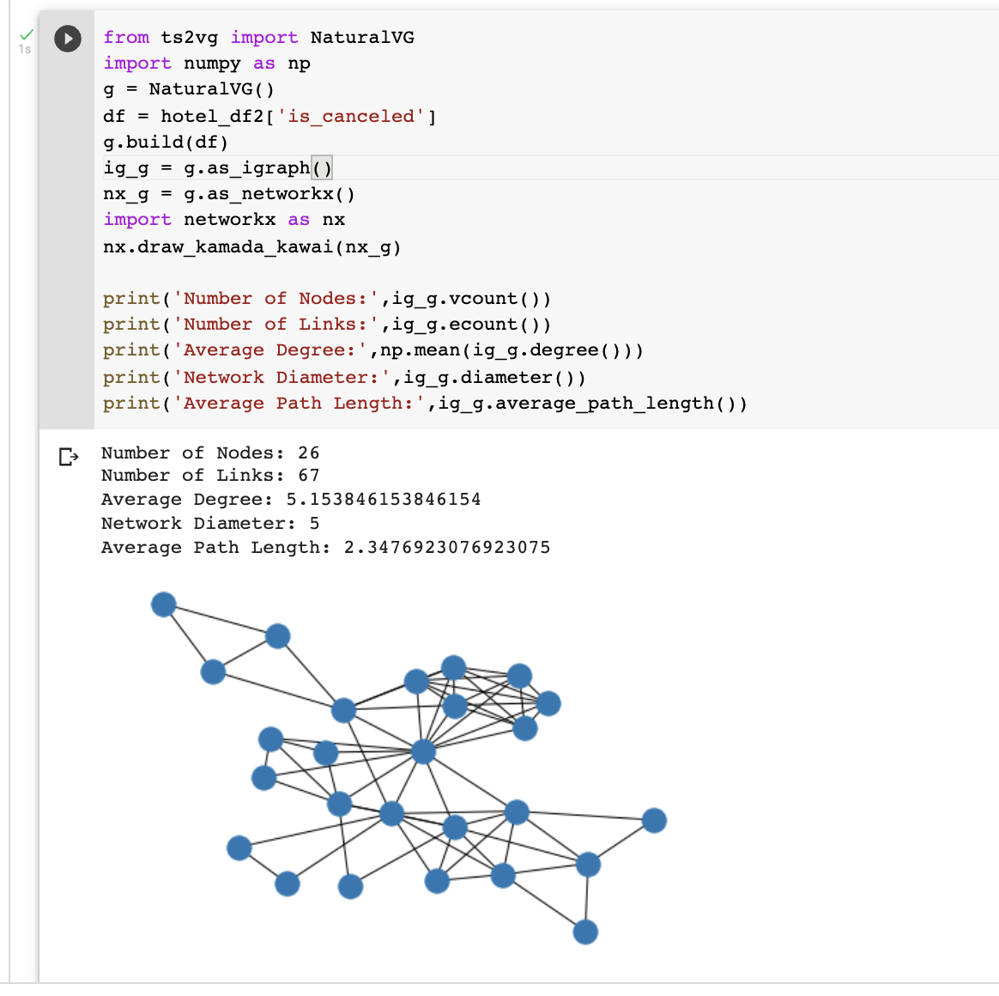
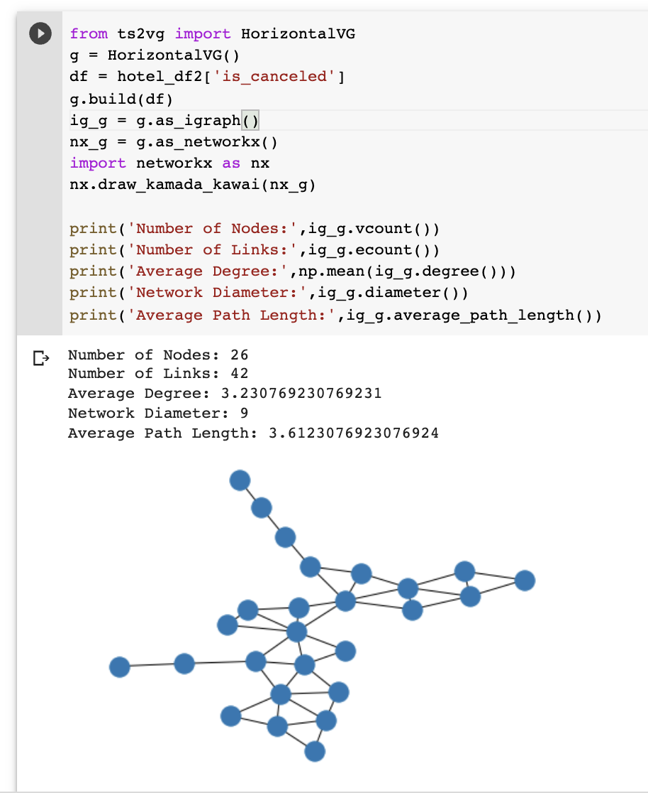

```{r echo=FALSE, message=FALSE}
library(ggplot2)
library(cluster)
library(fpc)
library(clValid)
library(factoextra)
library(dplyr)
library(lubridate)
library(tidyverse)
library(reshape2)
library(knitr)
library(hrbrthemes)
library(gridExtra)

```

## Data analysis on customer data may help the hotel management make informed decisions on staff allocations and create a personalized experience for the customers. It will also help the administration in developing an optimal pricing strategy. 

## We are using two datasets for our analysis. One dataset contains booking information of the hotels and includes information such as when the booking was made, length of stay, and cancellation status. The second dataset has reviews and ratings of hotels in Europe which can be used for sentiment analysis.


# Data Wranglling
#### 1. Eliminate NA and other undefined values 
#### 2. Very few booking shows the adults number is larger than 4. So, we regards those booking as abnormal value. Remove unreasonable values that have more than 4 adults in a room.
#### 3. Subset columns that are being used for further analysis
#### 4. Format month from string format to number
#### 5. Classify **hotel_type** and **got_desired_roomtype** as required for clustering
```{r message=FALSE, warning=FALSE}
customerdata <- read.csv("hotel_bookings.csv",na.strings = "")
customerdata <- customerdata[!is.na(customerdata$children), ]
customerdata$children <- as.integer(customerdata$children) 
customerdata <- customerdata[!is.na(customerdata$children), ]
customerdata$meal[customerdata$meal=='Undefined'] <- 'SC'
customerdata$children[is.na(customerdata$children)] <- 0
customerdata <- subset(customerdata, market_segment!='Undefined')
customerdata <- subset(customerdata, distribution_channel!='Undefined')
customerdata <- subset(customerdata, adults <= 4)
tempdataset<- customerdata[,c("adr","hotel","lead_time","is_canceled","arrival_date_month","is_repeated_guest","reserved_room_type","assigned_room_type","days_in_waiting_list","previous_cancellations","stays_in_weekend_nights","stays_in_week_nights","adults","children")]
tempdataset["Arrival_month"] <- match(tempdataset[,"arrival_date_month"],month.name)
tempdataset <- tempdataset %>% 
  mutate(hotel_type= case_when(hotel == "Resort Hotel" ~ 1,TRUE  ~ 2)) %>% 
  mutate(got_desired_roomtype= case_when(reserved_room_type == assigned_room_type ~ 1,TRUE  ~ 0)) 
tempdataset <- tempdataset[ , -which(names(tempdataset) %in% c("hotel","arrival_date_month","is_repeated_guest","reserved_room_type","assigned_room_type"))]
```

# Clustering
## 1. How to seggregate the hotel booking data? what is the optimal number of clusters?
```{r echo=FALSE}

set.seed(190)
clusterdatafinal <-tempdataset[sample(nrow(tempdataset), 10000), ]

clusterdata <- clusterdatafinal[ , -which(names(clusterdatafinal) %in% c("is_canceled","hotel_type","got_desired_roomtype","Arrival_month"))] 

dataframe_mc_scaled <- scale(clusterdata)

n_clust<-fviz_nbclust(dataframe_mc_scaled,FUNcluster = kmeans, method = c("silhouette")) 
n_clust<-n_clust$data
max_cluster<-as.numeric(n_clust$clusters[which.max(n_clust$y)])


```
### Through silhouette method, we have found that the booking data can be segregated in 4 distinct clusters

# Using K-Means, visualizing clusters
```{r echo=FALSE}
set.seed(123)
km_mc <- kmeans(dataframe_mc_scaled, max_cluster, nstart = 25)

fviz_cluster(km_mc, data = dataframe_mc_scaled)
```
## The clustering is done through k-means method

## 2. From the segregated groups (clusters) find which which attributes are more associated with cancellations?

```{r echo=FALSE}
groupeddata <- aggregate(clusterdatafinal, by=list(cluster=km_mc$cluster), mean)

p1 <- ggplot(groupeddata, aes(x=is_canceled, y=lead_time)) +
  geom_line( color="#69b3a2", size=1, alpha=0.9, linetype=2) +
  ggtitle("Cancels vs Lead time")


p2 <- groupeddata %>%
  ggplot( aes(x=is_canceled, y=adr)) +
    geom_area(fill="#69b3a2", alpha=0.5) +
    geom_line(color="#69b3a2") +
    ylab("ADR") +
    ggtitle("Cancels vs ADR")

p3 <- ggplot(groupeddata, aes(x=is_canceled, y=previous_cancellations)) +
  geom_line( color="#69b3a2", size=1, alpha=0.9, linetype=2) +
  ggtitle("Cancels  vs Previous cancels")

grid.arrange(p1, p2, p3)

```
## It is evident that, Cancels are mostly likely to happen if lead-time is more, meanwhile they might have changed plans or found a better deal 

## ADR is inversely related to cancellation. Customers who spent/ more likely to pay high amount per night are less likely to cancel their bookings

## Customers who have cancelled booking before are more likely cancel their bookings in the future


# Probability

## 3. Which attributes are correlated to cancellation? What attributes are more liekly to be dependent on each other?

```{r echo=FALSE}
corrdata <- tempdataset

corrdata["needs"] <-  customerdata["total_of_special_requests"]


corrdata <- corrdata %>%  
  rowwise() %>% 
  mutate(tota_days_stayed = sum(stays_in_week_nights,stays_in_weekend_nights)) %>% 
  mutate(total_guests = sum(adults,children))

corrdata <- corrdata[ , -which(names(corrdata) %in% c("stays_in_week_nights","stays_in_weekend_nights","hotel_type","got_desired_roomtype","Arrival_month","adults","children"))] 


cormat <- round(cor(corrdata),2)
melted_cormat <- melt(cormat)

ggplot(data = melted_cormat, aes(x=Var1, y=Var2, fill=value)) + 
  geom_tile() + 
  theme(axis.text.x = element_text(angle = 45, vjust = 1, size = 9, hjust = 1)) +
  coord_fixed()
```
## Cancellation is not dependent on the number of requests raised during the booking. Cancellation has positive correlation with lead time. 

## Total number of guests and ADR have good positive corrrelation. 

## 4. Which "duration of stay" is more likely to be cancelled? 

## PMF and CDF for total_days_stayed in hotel a reservation
## Bar plot showing the distribution of cancellation probability vs total_days

```{r echo=FALSE, fig.height=2, fig.width=5}
csp_freq <- corrdata %>% filter(is_canceled==1)  %>% 
  select(tota_days_stayed) %>%
  group_by(tota_days_stayed) %>%
  summarise(count = n()) %>%
  mutate(pickup_pmf = count/sum(count)) %>%
  mutate(pickup_cdf = cumsum(pickup_pmf))


csp_freq1 <- csp_freq %>% 
  filter(tota_days_stayed!=0) %>%
  mutate(tota_days_stayed = case_when(tota_days_stayed>7 ~ "More than a week",TRUE ~ as.character(tota_days_stayed))) %>%   group_by(tota_days_stayed) %>% 
  summarize(tcount= sum(count), ,t_pmf=sum(pickup_pmf),tcmf=max(pickup_cdf))

ggplot(csp_freq1, aes(tota_days_stayed, t_pmf)) +
  geom_bar(stat="identity", fill="steelblue") + 
  theme_bw() +
  labs( y = 'Cancelation Probability') +
  theme(plot.title = element_text(hjust = 0.5))
```
## Customers who have booked the hotel for 2-3 days are more liekly to cancel their reservation


## 5.  What type of bookings are likely to get cancelled? Does these customers who cancel the booking usually pay deposit?

```{r echo=FALSE, warning=FALSE}
canc <-
  customerdata %>%
  group_by(customer_type,deposit_type) %>% filter(is_canceled==1)  %>% 
  summarize(nope = n())


canc.final <- 
  canc %>%
  ungroup() %>%
  mutate(prop = round(nope / sum(nope),3))

canc.final %>%
  dcast(customer_type ~ deposit_type, value.var = "prop") 
```

##  Transient customers (individual booking) whodoesn't pay initial deposit are more likely to cancel their reservations. THey hold 53% of the total cancellation data


# Time Series Analysis

## 6. Distribution of cancellations per month?

## Let's check trend of Cancels over the time. Here is the SNS line plot for number of cancels per month over the time


## Natural Visual Graph 



## Horizontal Visual Graph


```{r echo=FALSE, message=FALSE}
library(tidyverse)
library(nonlinearTseries)
```


## 7. RQA analysis of our data

```{r echo=FALSE, warning=FALSE}
hotel_data <- read.csv("hotel_bookings.csv",na.strings = "")

`%ni%` <- Negate(`%in%`)

arr_month <- c("January", "February", "March", "April", "May", "June", "July", 
               "August", "September", "October", "November", "December")

hotel_data$arrival_date_month = match(substr(hotel_data$arrival_date_month, 1, 3), month.abb)

df = hotel_data %>%
    filter(country %ni% c('NULL' ) ) %>%
    unite(col="arrival_date", sep = "-", 
      c('arrival_date_year', 'arrival_date_month', 'arrival_date_day_of_month')) %>%
    mutate(arrival_date = as.Date(arrival_date, format='%Y-%m-%d')) %>%
    group_by(arrival_date) %>%
    summarise(Not_cancels = sum(is_canceled==0)
              , Cancels = sum(is_canceled==1) ) %>%
    arrange(arrival_date)

```

## Reccurence plot of acc signals for Cancels per Day

```{r echo=FALSE, warning=FALSE}

time_s <- df$Cancels[400:600]
rqa.analysis=rqa(time.series = time_s, embedding.dim=2, time.lag=1 ,
                 radius=10,lmin=2,do.plot=TRUE,distanceToBorder=2)

```

## 8. Trend and Forecast of Cancellations over the time.
### First two plots show the trend of Cancellations in current data
### Next two plots forecast future cancellations using HoltWinters method

```{r echo=FALSE, warning=FALSE, message=FALSE}

library(seasonal) 
library(fpp2)

df = hotel_data %>%
    filter(country %ni% c('NULL' ) ) %>%
    group_by(arrival_date_year, arrival_date_month) %>%
    summarise(Cancels_per = sum(is_canceled==1) / n(),
              Cancels = sum(is_canceled==1)) %>%
    arrange(arrival_date_year, arrival_date_month)

t = ts(data = df$Cancels, frequency=12, start = 2015 )
p1 <- autoplot(t, main = "Total Cancellations From : 2015")

p2 <- ggseasonplot(t, main = "Seasonal Plot: Total Cancels", labelgap = 0.04) 

p3 <- autoplot(t, main = "Future forecast of Cancellations") +
  autolayer(hw(t, seasonal = "multiplicative", PI=FALSE))

p4 <- autoplot(forecast(HoltWinters(t, gamma=FALSE)))


grid.arrange(grobs = list(p2, p1, p3, p4), nrow=2)
```

## 9. Permutation Entropy of Cancels
## Entropy is ~0.93 very high indicating, randomness of cancel behaviour
## Complexity is ~ 0.05


# Text Analysis

```{r echo=FALSE, message=FALSE, warning=FALSE}
library(tidytext)
library(textdata)
library(wordcloud2)
library(ggplot2)
library(dplyr)
library(tidyverse)
library(lubridate)
library(stringr)
library(tidyr)
library(knitr)
library(readr)
```

```{r echo=FALSE, warning=FALSE, message=FALSE}

reviews <- read_csv('Datafiniti_Hotel_Reviews_Jun19.csv')
```

## Removing stop words and tokenizing the text
```{r echo=FALSE, warning=FALSE}

tidy_reviews <- reviews %>% 
  unnest_tokens(word, reviews.text, token = "words") %>%
  filter(!word %in% stop_words$word,
         !word %in% str_remove_all(stop_words$word, "'"),
         !word == 'hotel',
         str_detect(word, "[a-z]"))
```
## 10. Most common topics of interest
## Bar plot for most common words
```{r echo=FALSE, warning=FALSE, fig.height=2, fig.width=5}

tidy_reviews %>% 
  count(word, sort=TRUE) %>%
  top_n(10) %>%
  ggplot(aes(x=reorder(word, n), y=n)) +
  geom_col() +
  coord_flip() +
  labs(x="Word", y="Count",
       title="Most common words used in Reviews") +
  theme_minimal()

```


## Wordcloud with top 100 words

```{r echo=FALSE, results='osis', warning=FALSE, message=FALSE}
library(wordcloud)

pal <- brewer.pal(10, "BrBG")
p1 <- tidy_reviews %>%
  count(word) %>%
  with(wordcloud(word, n, max.words = 100, random.order=FALSE, colors = pal))

```

## As seen from the bar graph and word cloud, the most common words in reviews are stay, staff, location, time,clean, breakfast among.
## So these are the topics of interest amon consumers and the hotels should look to make improvements on them.

## 12. Sentiment analysis of customer reviews
### Sentiment
```{r echo=FALSE, warning=FALSE}

top_words <-tidy_reviews %>% 
   count(word, sort=TRUE) %>%
   top_n(10) %>%  select(word)

grams <-
  reviews %>% 
  unnest_tokens(grams, reviews.text, token = "ngrams",n=2) %>%
  separate(grams, c("word1", "word2"), sep = " ") %>%
  filter(!word1 %in% stop_words$word)
  
grams %>% 
  select(word1,word2) %>% 
  filter(word2 %in% top_words$word) %>% 
  inner_join(get_sentiments("afinn"), by=c("word1"="word")) %>% 
  mutate(sentiment1=value) %>%
  group_by(word2) %>% 
  summarise(sentiment_value_from_prev_word=mean(sentiment1)) %>% 
  arrange(-sentiment_value_from_prev_word)
```
## The sentiments around breakfast, time, stayed, staff are a little less which the hotels should work on

```{r echo=FALSE, warning=FALSE, message=FALSE}
top_provinces <- reviews %>%
  count(province, sort=TRUE) %>%
  top_n(6) %>%  select(province)

top_words <-tidy_reviews %>% 
   count(word, sort=TRUE) %>%
   top_n(250) %>%  select(word)

c_df <- reviews %>%
  filter(province %in% top_provinces$province) %>% 
  select(province, reviews.text, reviews.date) %>%
  group_by(province) %>%
  mutate(review_number = row_number()) %>%
  ungroup()


library(tidytext)
tidy_words <- c_df %>%
  unnest_tokens(word, reviews.text)


data(stop_words)

tidy_words <- tidy_words %>%
  anti_join(stop_words)

df_sentiment <- tidy_words %>%
  inner_join(get_sentiments("bing")) %>%
  count(province, index = review_number %/% 10, sentiment) %>%
  pivot_wider(names_from = sentiment, values_from = n, values_fill = 0) %>% 
  mutate(sentiment = positive - negative)

ggplot(df_sentiment, aes(index, sentiment, fill = province)) +
  geom_col(show.legend = FALSE) +
  facet_wrap(~province, ncol = 2, scales = "free_x")
```
## 13. What are the hotels which have highly positive reviews?

```{r echo=FALSE, warning=FALSE, fig.height=2, fig.width=5}
hotel_counts <- reviews %>% group_by(name) %>% summarise(count=n())

tidy_reviews %>%  
  inner_join(get_sentiments("afinn")) %>% 
  group_by(name) %>% 
  summarise(sentiment_afinn=sum(value)) %>% 
  inner_join(hotel_counts) %>% 
  mutate(sentiment = sentiment_afinn/count) %>%
  arrange(-sentiment) %>% top_n(10) %>% 
  ggplot( aes(x =reorder(name, sentiment), y=sentiment)) +
  geom_bar(stat="identity")+
  ggtitle("Top Rated Hotels")+
  labs(x="Time of Day", y="Total Accidents")+
  theme(plot.title = element_text(hjust = 0.5)) +
  coord_flip() 
```
## These are the hotels which have reviews with high positivity


# Recommendations:

## Customers who have booked the hotels very early are more likely to cancel their reservations. Hotel manangement should provide timely reminders to the customers who have booked the rooms.

## Double check the reservations with customers who had previously cancelled their booking.

## Hotel management should impose a rule that reservations should be accompanied with minimum deposit.

## Assign more staff during winter as more bookings are likely to be made for that season.

## "Cleanliness", "Friendly staff" and "Quality of meal" are the major propellent for good rating for hotels.
